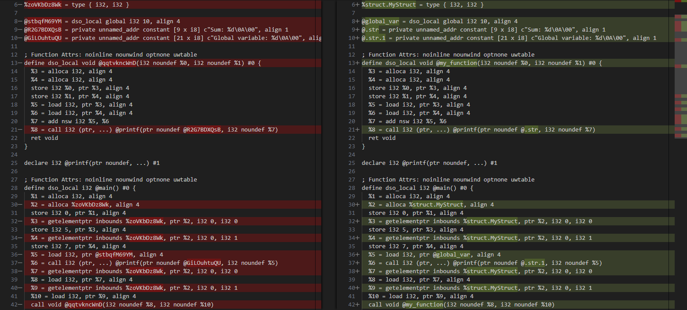
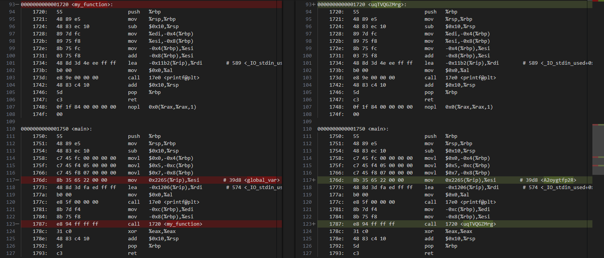

# Identifier Mangling Pass

An LLVM module pass that performs **identifier mangling** at the IR level — randomizing function names, global variable names, and struct type names at compile time to hinder static analysis and reverse engineering.

---

## How it works

The pass hooks into LLVM's new pass manager as a **module pass** — meaning it operates on the entire module at once rather than function by function.

For each module it processes:

1. **Functions** — every non-declaration function except `main` gets its name replaced with a 10-character random alphanumeric string
2. **Global variables** — all global variable names are replaced
3. **Struct types** — all named struct types are renamed

The randomization uses `std::mt19937` seeded from `std::random_device`, generating strings from a 62-character alphabet (`a-z`, `A-Z`, `0-9`).

The pass operates at the **LLVM IR level**, not the source level — which means:
- It's language-agnostic (works on any language that compiles to LLVM IR)
- Symbol renaming is consistent within the module (all references are updated)
- Debug symbols and DWARF info still reference original names unless stripped separately

---

## Prerequisites

- LLVM (tested with LLVM 14+)
- CMake ≥ 3.13
- Clang (to compile input code to IR)

---

## Build

```bash
git clone https://github.com/Ily455/IM-LLVM-Pass.git
cd IM-LLVM-Pass
mkdir build && cd build
cmake ..
make
```

This produces `build/ManglePass.so`.

---

## Usage

### 1. Compile your source to LLVM IR

```bash
clang -S -emit-llvm input.c -o input.ll
```

### 2. Run the pass

Produce readable IR:
```bash
opt -S -load-pass-plugin ./build/ManglePass.so -passes=manglepass input.ll -o output.ll
```

Produce bitcode:
```bash
opt -load-pass-plugin ./build/ManglePass.so -passes=manglepass input.ll -o output.bc
```

### 3. Compile the mangled IR to a binary

```bash
clang output.ll -o output
```

---

## Example

See the [`example/`](example/) directory for a full walkthrough.

Input C code with meaningful names:

```c
struct structurino { int iks; int igrig; };
int varstandsforvideoassistantrefereee = 666;
void my_function(int a, int b) { ... }
```

After the pass — all identifiers replaced with random strings at the IR level:

**IR diff:**



**Assembly diff:**



The binary remains functionally identical — only the symbol names change.

---

## Limitations

Identifier mangling is a **weak standalone obfuscation**. A few things worth knowing:

- `main` is intentionally preserved (required entry point for the linker)
- External library calls (e.g. `printf`) are declarations, not definitions — they are not renamed
- Debug info (`-g`) still embeds original names in DWARF sections — strip separately with `llvm-strip --strip-debug`
- A determined analyst can recover intent through dataflow analysis regardless of symbol names
- This pass is designed as a building block, not a complete obfuscation solution

---

## Project structure

```
IM-LLVM-Pass/
├── ManglePass.cpp       # Pass implementation
├── CMakeLists.txt       # Build configuration
├── LICENSE
└── example/
    ├── test.c           # Sample input
    ├── test.ll          # Normal IR
    ├── mangled-test.ll  # IR after pass
    ├── normal-assembly.asm
    ├── mangled-assembly.asm
    ├── IR-diff.png
    └── assembly-diff.png
```

---

## License

MIT — see [LICENSE](LICENSE).
